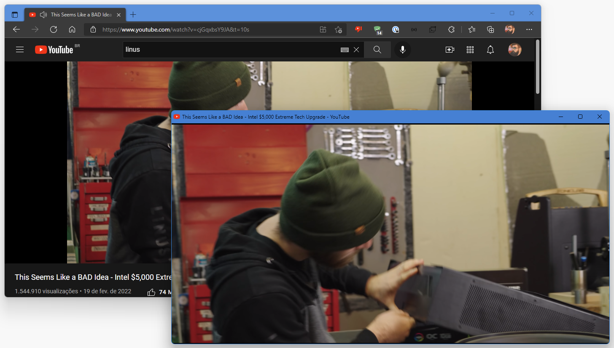

# Window PopUp 

A simple Chromium extension to open the current tab in a new window in Chromium app mode to improve focus and experience. It can open a Youtube video with embeed link.

## How to use

Just go to any website that you want to watch and click the extension button.

It also works for Youtube!

## Where to get it
It's not available on any store yet but will be soon. You can clone the project and import as a Unpackaed extension.